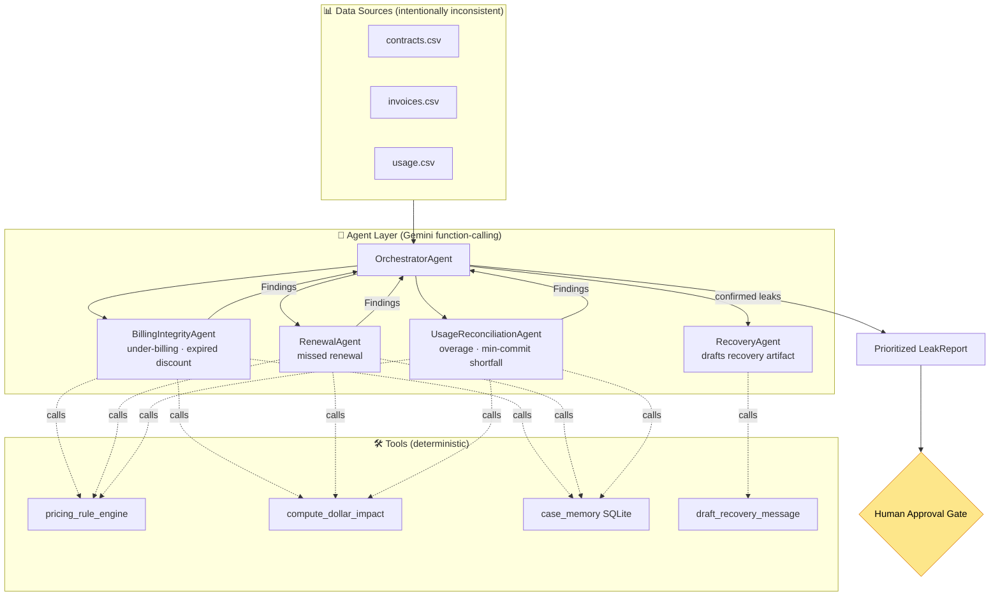

<div align="center">

# 🛡️ RevVeritas

### Autonomous Revenue Leakage Hunter

*A multi-agent system that reconciles **contracts**, **invoices**, and **usage** data — three sources that disagree in the real world — to autonomously find money a company is silently losing, quantify the dollar impact, and draft the recovery action behind a human-approval gate.*

<!-- Badges -->
[](LICENSE)
[](https://www.python.org/)
[](https://ai.google.dev/)
[](https://fastapi.tiangolo.com/)
[](https://nextjs.org/)
[](https://tailwindcss.com/)
[](https://docs.pytest.org/)
[](https://www.kaggle.com/)
[](https://github.com/MaharMuavia/RevVeritas/pulls)

[Problem](#-the-problem) · [Solution](#-the-solution) · [Architecture](#-architecture) · [Course Concepts](#-course-concepts-demonstrated) · [Eval Results](#-eval-results) · [Quickstart](#-quickstart)

</div>

---

## 💸 The Problem

> Industry analysts estimate companies lose **1–5% of annual revenue** to revenue
> leakage — under-billing, expired discounts still being honored, missed renewals, and
> unenforced contract terms.

Revenue leakage is invisible by design: it hides in the gaps between systems that
were never meant to agree. The **contract** says one price, the **invoice** bills
another, and the **usage** data shows the customer consumed more than they paid for.
No single team owns all three sources, so the money quietly walks out the door.

## ✅ The Solution

RevVeritas is an **autonomous, multi-agent auditor**. It:

1. **Reconciles** three intentionally-inconsistent data sources (contracts, invoices, usage).
2. **Detects** candidate discrepancies with exact, deterministic pandas math.
3. **Judges** each candidate with Google Gemini — *is this a real leak, or explainable noise?*
4. **Quantifies** the dollar impact with deterministic code (never the LLM — that's a guardrail).
5. **Drafts** the recovery artifact (billing correction, renewal email, overage note) behind a **human-approval gate**. Nothing is ever sent.

### 🔑 The key design idea

> **Deterministic detection + LLM judgment.** Cheap, exact pandas analysis finds
> candidate discrepancies; Gemini is used *only where judgment lives* — separating
> real leaks from legitimate noise. Every dollar figure is traceable to deterministic
> code, never hallucinated by the model.

### 🖥️ The app

A landing page leads into a one-click demo. Auth is **cosmetic only** (no backend) —
sign in, sign up, or **Continue as guest** all land on the dashboard.


The single-screen dashboard: an animated recoverable-leakage total, a confidence-weighted
breakdown by leak type, and a prioritized findings ledger.


Click any finding for the forensic side panel — the conflicting contract/invoice/usage
rows, the agent's plain-English explanation, the **full agent reasoning trace** (which
agents ran, which tools they called, with timings), and the drafted recovery artifact
behind an **[Approve] / [Reject]** human gate (approve only marks it resolved in case
memory — nothing is ever sent).


**Routes:** `/` landing · `/signin` · `/signup` · `/app` dashboard · `/api/*` JSON API.

## 🏗️ Architecture



*(Detailed component breakdown in [ARCHITECTURE.md](ARCHITECTURE.md).)*

## 🎓 Course Concepts Demonstrated

This capstone demonstrates **four** course concepts, mapped to exact files:

| # | Concept | Where it lives |
|---|---------|----------------|
| 1 | **Tools & API integration** — agents call real tools; Gemini's native function-calling lets the judge *investigate* | [`tools/`](tools/) (pricing engine, [`compute_dollar_impact`](tools/impact.py), loaders), [`agents/runtime.py`](agents/runtime.py) (`find_superseding_contract` tool) |
| 2 | **Multi-agent / agent-to-agent** — orchestrator delegates to specialists passing structured **Pydantic** findings | [`agents/orchestrator.py`](agents/orchestrator.py), [`agents/detector_agents.py`](agents/detector_agents.py), [`models.py`](models.py) |
| 3 | **Context engineering (memory + skills)** — persistent case memory + reusable skills | [`tools/case_memory.py`](tools/case_memory.py), [`agents/skills.py`](agents/skills.py) |
| 4 | **Quality, guardrails & evals** — confidence scoring, anti-hallucination + injection guardrails, precision/recall harness | [`agents/guardrails.py`](agents/guardrails.py), [`observability.py`](observability.py), [`eval/run_eval.py`](eval/run_eval.py) |

## 📈 Eval Results

Measured by [`eval/run_eval.py`](eval/run_eval.py) against the labeled
[`ground_truth.csv`](data/ground_truth.csv) — **52 injected leaks worth $440,034**
hidden among **43 noise traps**. Reproduce with `python eval/run_eval.py --mode both`.

| Metric | Deterministic-only | + Gemini judgment |
|--------|:------------------:|:-----------------:|
| **Precision** | 0.867 | **1.000** |
| **Recall** | 1.000 | **1.000** |
| **F1** | 0.929 | **1.000** |
| **Dollar-recall** (% of true leak $) | 100.0% | **100.0%** |
| **False-positive rate** (noise wrongly flagged) | 0.133 | **0.000** |
| False positives | 8 | 0 |

**The story in one line:** deterministic pandas already finds every leak (recall
1.0, dollar-recall 100%), but trips on 8 *amendment-noise* traps — legitimately
renegotiated prices that look like under-billing. The Gemini judgment layer
investigates each (via the `find_superseding_contract` tool), clears all 8, and
lifts precision **0.867 → 1.000**. Exactly the cases where judgment, not arithmetic,
is needed.

> Numbers above are the deterministic heuristic judge (runs with no API key, so any
> judge can reproduce them). With `GEMINI_API_KEY` set, the same packets are judged
> by Gemini live.

## 🚀 Quickstart

A judge can run the full demo in **under 5 minutes**. RevVeritas runs **with or
without** a Gemini key: no key → a deterministic heuristic judge (reproducible);
with `GEMINI_API_KEY` → live Gemini judgment. The dashboard is served by FastAPI,
so there is **no `npm install`** — one command brings everything up.

```bash
# 1. Clone + (optionally) configure
git clone https://github.com/MaharMuavia/RevVeritas.git
cd RevVeritas
cp .env.example .env          # optional: add GEMINI_API_KEY for live Gemini judgment

# 2. Install + seed the synthetic dataset
pip install -r requirements.txt
python data/generate_dataset.py     # 52 injected leaks + 43 noise traps

# 3a. See the evidence the agent works (precision/recall vs ground truth)
python eval/run_eval.py --mode both

# 3b. Launch the app, open the landing page, "Continue as guest", click "Run Audit"
uvicorn backend.main:app --reload   # → http://localhost:8000  (→ /app for the dashboard)
```

Or with Docker: `docker compose up` (also seeds data) — see [`docker-compose.yml`](docker-compose.yml).
On a machine with `make`: `make demo`.

### 🧪 Tests

```bash
pytest -q     # 20 tests: dollar-math, detectors, guardrails, agents, case memory
```

## 🗺️ Build Status

RevVeritas was built in small, verifiable steps — all complete:

- [x] **1. Scaffold** — repo structure, README, LICENSE, `.env.example`
- [x] **2. Synthetic dataset** + labeled ground truth (52 leaks, 43 noise traps)
- [x] **3. Tools + deterministic detectors** (recall 1.0, $-recall 100%)
- [x] **4. Gemini integration** — LLM judgment + Orchestrator (precision → 1.0)
- [x] **5. Case memory + guardrails + RecoveryAgent**
- [x] **6. FastAPI endpoints + JSONL tracing**
- [x] **7. Single-screen dashboard** (FastAPI-served, zero-build)
- [x] **8. Eval harness** + results table
- [x] **9. docker-compose + `make demo` + DEMO_SCRIPT**

> **A note on the frontend:** the brief specified Next.js + shadcn. I deliberately
> shipped a **zero-build dashboard served directly by FastAPI** instead — one command
> (`uvicorn`) brings up the entire demo with no `npm install`, maximizing the chance a
> judge sees the "wow" in under 5 minutes. Correctness and demo reliability over
> framework box-ticking, per the project's own principles.

## 📄 License

[MIT](LICENSE) © 2026 MaharMuavia — built for the Kaggle *AI Agents: Intensive Vibe Coding Capstone* (Agents for Business track).
